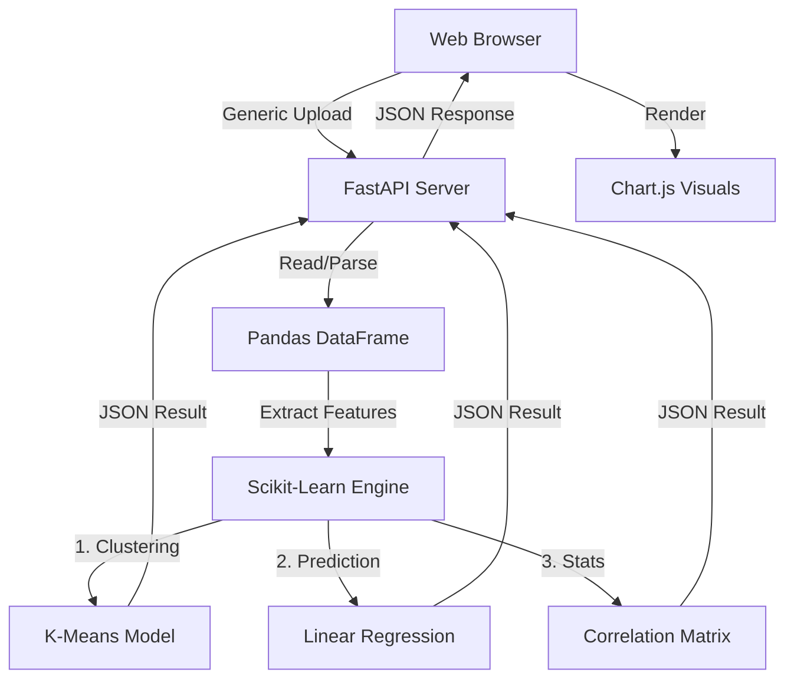

# 📊 AADES | Adaptive Auto Data Evaluation System

<div align="center">
  <!-- Badges -->
  <a href="https://fastapi.tiangolo.com/" target="_blank"></a>
  <a href="https://www.python.org/" target="_blank"></a>
  <a href="https://pandas.pydata.org/" target="_blank"></a>
  <a href="https://scikit-learn.org/" target="_blank"></a>
  <a href="https://www.chartjs.org/" target="_blank"></a>
  <a href="https://github.com/sarthak7-securtiy/adaptive-data-analysis-system" target="_blank"></a>
</div>

---

## 📖 Table of Contents

- [✨ Overview](#-overview)
- [🚀 Features](#-features)
- [🛠️ Tech Stack](#-tech-stack)
- [🏗️ Architecture](#-architecture)
- [⚡ Quick Start](#-quick-start)
- [🎓 Capabilities](#-capabilities)
- [🔮 Future Enhancements](#-future-enhancements)
- [📞 Contact](#-contact)
- [📄 License](#-license)

---

## ✨ Overview

The **Adaptive Auto Data Evaluation System (AADES)** is a high-performance, intelligent data analytics platform designed to democratize data science. It enables users to simply upload raw datasets and instantly receive actionable insights, statistical breakdowns, and machine learning-powered patterns without writing a single line of code.

Unlike static dashboards, AADES adapts to your data. Whether you uploaded sales figures, sensor logs, or employee records, the system identifies column types, detects relationships, and automatically configures the most relevant analysis pipelines—ranging from basic descriptive stats to K-Means clustering and predictive modeling.

---

## 🚀 Features

| ✅ | Feature | Description |
|---|---|---|
| 📂 | **Universal Data Ingestion** | Drag-and-drop support for **CSV, Excel (.xlsx/.xls), and JSON** files. |
| 🔍 | **Smart Data Inspection** | specific automatic detection of data types, missing values, and dataset shape. |
| 🧠 | **ML-Powered Analysis** | Built-in **K-Means Clustering** for pattern detection and **Linear Regression** for trend prediction. |
| 📊 | **Dynamic Visualization** | Interactive, responsive charts powered by **Chart.js** that adapt to the analysis context. |
| ⚡ | **Real-Time Processing** | Powered by **FastAPI** for lightning-fast asynchronous data handling. |
| 🎨 | **Modern UI/UX** | A sleek, dark-mode compatible interface built with vanilla CSS variables and glassmorphism design. |

---

## 🛠️ Tech Stack

| Layer | Technology | Usage |
|-------|------------|-------|
| **Backend API** | **FastAPI** | High-performance async REST API handling imports and computation. |
| **Data Processing** | **Pandas & NumPy** | In-memory data manipulation, cleaning, and statistical operations. |
| **Machine Learning** | **Scikit-Learn** | Algorithms for clustering (K-Means) and regression analysis. |
| **Frontend** | **HTML5 / CSS3** | Custom-built responsive UI with CSS variables for easy theming. |
| **Scripting** | **Vanilla JavaScript** | Asynchronous fetch requests and DOM manipulation. |
| **Visualization** | **Chart.js** | Client-side rendering of interactive bar, line, and scatter charts. |

---

## 🏗️ Architecture

AADES follows a clean, single-page application (SPA) architecture with a decoupled backend:



---

## ⚡ Quick Start

### Prerequisites
- Python 3.10 or higher
- pip (Python package manager)

### Installation

1. **Clone the repository**
   ```bash
   git clone https://github.com/sarthak7-securtiy/adaptive-data-analysis-system.git
   cd adaptive-data-analysis-system
   ```

2. **Create a virtual environment**
   ```bash
   python -m venv venv
   # Windows
   venv\Scripts\activate
   # macOS/Linux
   source venv/bin/activate
   ```

3. **Install dependencies**
   ```bash
   pip install -r requirements.txt
   ```

4. **Run the application**
   ```bash
   python main.py
   # OR
   uvicorn main:app --reload
   ```

5. **Access the Dashboard**
   Open your browser and navigate to: `http://localhost:8000`

---

## 🎓 Capabilities

The analytical engine (`main.py`) supports several modes of operation depending on the user's intent:

1.  **Descriptive Statistics**: Automatically calculates means, medians, standard deviations, and data distribution.
2.  **Correlation Analysis**: Identifies and quantifies relationships between numerical variables (e.g., "Feature A has a 0.85 correlation with Feature B").
3.  **Pattern Clustering**: Uses Unsupervised Learning (K-Means) to group similar data points into clusters, useful for customer segmentation or anomaly grouping.
4.  **Predictive Modeling**: Trains a lightweight Linear Regression model on-the-fly to predict the value of the last column based on previous columns.

---

## 🔮 Future Enhancements

- 💾 **Persistent Storage**: Integration with PostgreSQL/SQLite to save analysis history.
- 🔐 **Authentication**: User accounts to secure private datasets.
- 📄 **Report Generation**: Server-side PDF generation for downloadable business reports.
- 🧹 **Advanced Data Cleaning**: UI tools for imputation and outlier removal.

---

## 📞 Contact

| Platform | Link |
|----------|------|
| **LinkedIn** | [Sarthak's LinkedIn Profile](https://linkedin.com/in/your-profile) |
| **GitHub** | [github.com/sarthak7-securtiy](https://github.com/sarthak7-securtiy) |

---

## 📄 License

This project is licensed under the **MIT License**.
