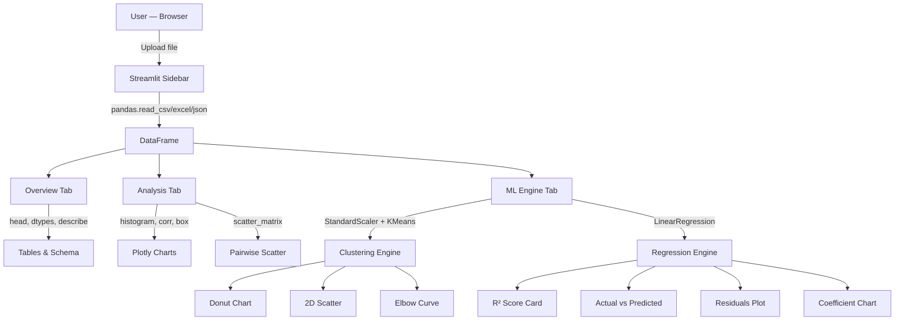

<div align="center">

# ⚡ AADES
### Adaptive Auto Data Evaluation System

**Turn raw datasets into actionable intelligence — zero code required.**

<br/>


<br/>

> **v2.0** — Complete UI overhaul · Orbital animations · Glassmorphism cards · Residual plots · Elbow curves

</div>

---

## 📌 Overview

**AADES** is an intelligent, no-code data analytics platform built with Streamlit. Upload any structured dataset — CSV, Excel, or JSON — and the platform automatically:

- Profiles your data schema and quality
- Generates interactive statistical visualisations
- Runs unsupervised machine learning (K-Means clustering)
- Trains and evaluates a predictive regression model
- Produces a residuals analysis and feature coefficient chart

All in seconds. No pandas knowledge needed. No Jupyter notebook required.

---

## 🖥 UI Preview

The interface is designed to production-grade, recruiter-ready standards:

| Feature | Details |
|---|---|
| 🌌 **Background** | Animated dot-grid mesh with multi-layer radial gradient glows |
| 🔝 **Navbar** | Breadcrumb route bar with live status badges |
| 📣 **Hero Section** | Space Grotesk fluid typography with cyan→blue→violet gradient |
| 🌀 **Empty State** | Three-ring CSS orbital animation system with glowing orbiters |
| 💳 **KPI Cards** | Glassmorphism, per-color glow, animated fill-bar on mount |
| 🗂 **Sidebar** | Spinning ring logo, live pulse dots, JetBrains Mono tech stack |
| 📊 **Charts** | Histogram, correlation heatmap, box plots, scatter matrix, residuals, coefficients |
| 🤖 **ML Output** | Large R² score card, actual vs predicted, elbow curve, coefficient bar chart |

---

## 🚀 Features

### 📋 Overview Tab
- **Data Preview** — First 15 rows, full-width table
- **Schema Inspector** — Dtype, missing count, missing %, unique count, sample value per column
- **Descriptive Statistics** — Transposed `describe()` table across all numeric columns
- **One-click CSV Export** — Download the loaded dataset instantly

### 📈 Analysis Tab
- **Feature Distribution** — Histogram with marginal box-plot overlay (column-selectable)
- **Correlation Heatmap** — Pearson correlation matrix, custom indigo→midnight→cyan scale
- **Distribution Spread** — Coloured box + whisker plots for all numeric columns simultaneously
- **Scatter Matrix** — Auto-rendered pairwise scatter for datasets with ≤6 numeric columns

### 🤖 ML Engine Tab

#### K-Means Clustering
- StandardScaler preprocessing → K-Means++ init
- Configurable K via interactive slider (2–10)
- Donut chart — cluster size distribution
- 2D scatter — cluster assignment visualisation (first two features)
- **Elbow curve** — inertia vs K up to K+3, with a vertical dashed marker at selected K

#### Linear Regression (OLS)
- Target column selector
- Large **R² score hero card** with quality label (Excellent / Good / Moderate)
- Actual vs Predicted line chart (area fill, first 100 samples)
- **Residuals scatter** — colour-mapped by magnitude (indigo → cyan)
- **Feature coefficients bar chart** — red for negative, cyan for positive, sorted by |magnitude|

---

## 🛠 Tech Stack

| Layer | Technology | Purpose |
|---|---|---|
| **UI Framework** | Streamlit 1.35+ | App shell, widgets, routing |
| **Styling** | Vanilla CSS · Space Grotesk · Inter · JetBrains Mono | Design system |
| **Data Processing** | Pandas · NumPy | Ingestion, cleaning, stats |
| **Machine Learning** | scikit-learn | KMeans, StandardScaler, LinearRegression |
| **Visualisation** | Plotly (Express + Graph Objects) | All interactive charts |
| **Runtime** | Python 3.11+ | Core language |

---

## ⚡ Quick Start

### Prerequisites
- Python 3.11 or higher
- `pip` (Python package manager)
- Git

### 1. Clone the repository
```bash
git clone https://github.com/sarthak7-securtiy/Adaptive-Auto-Data-Evaluation-System.git
cd Adaptive-Auto-Data-Evaluation-System
```

### 2. Create and activate a virtual environment
```bash
# Create
python -m venv venv

# Activate — Windows
venv\Scripts\activate

# Activate — macOS / Linux
source venv/bin/activate
```

### 3. Install dependencies
```bash
pip install -r requirements.txt
```

### 4. Launch the app
```bash
python -m streamlit run main.py
```

### 5. Open in browser
```
http://localhost:8501
```

Upload any `.csv`, `.xlsx`, or `.json` file from the sidebar panel and the full analytics pipeline activates instantly.

---

## 🏗 Architecture


```mermaid
graph TD
    U[User — Browser] -->|Upload file| SB[Streamlit Sidebar]
    SB -->|pandas.read_csv/excel/json| DF[DataFrame]

    DF --> OV[Overview Tab]
    DF --> AN[Analysis Tab]
    DF --> ML[ML Engine Tab]

    OV -->|head, dtypes, describe| T1[Tables & Schema]
    AN -->|histogram, corr, box| V1[Plotly Charts]
    AN -->|scatter_matrix| V2[Pairwise Scatter]

    ML -->|StandardScaler + KMeans| CL[Clustering Engine]
    ML -->|LinearRegression| RG[Regression Engine]

    CL --> D1[Donut Chart]
    CL --> D2[2D Scatter]
    CL --> D3[Elbow Curve]

    RG --> R1[R² Score Card]
    RG --> R2[Actual vs Predicted]
    RG --> R3[Residuals Plot]
    RG --> R4[Coefficient Chart]
```

---

## 📁 Project Structure

```
Adaptive-Auto-Data-Evaluation-System/
├── main.py                 # Single-file Streamlit app (UI + logic)
├── requirements.txt        # Python dependencies
├── .streamlit/
│   └── config.toml         # Theme tokens (cyan / deep navy palette)
├── docs/                   # Additional documentation assets
├── .gitignore
└── README.md
```

---

## 📦 Dependencies

```
streamlit
pandas
numpy
scikit-learn
plotly
openpyxl
requests
streamlit-lottie
```

Install all at once:
```bash
pip install -r requirements.txt
```

---

## 🔮 Roadmap

| Status | Feature |
|---|---|
| ✅ | CSV / Excel / JSON ingestion |
| ✅ | Schema inspector with missing % and sample values |
| ✅ | Descriptive stats (transposed) |
| ✅ | Correlation heatmap (Pearson) |
| ✅ | Feature distribution histogram + box |
| ✅ | Multi-column box plot overlay |
| ✅ | Pairwise scatter matrix |
| ✅ | K-Means++ clustering with elbow curve |
| ✅ | Linear regression with residuals + coefficients |
| ✅ | v2.0 glassmorphism UI with animated orbital empty state |
| 🔲 | Categorical feature encoding & visualisation |
| 🔲 | Random Forest / XGBoost model options |
| 🔲 | PDF report export |
| 🔲 | Persistent session history (SQLite) |
| 🔲 | User authentication layer |

---

## 📄 License

This project is licensed under the **MIT License** — free to use, fork, and extend.

---

<div align="center">
  <sub>Built with ⚡ by <a href="https://github.com/sarthak7-securtiy">Sarthak</a> · AADES v2.0</sub>
</div>